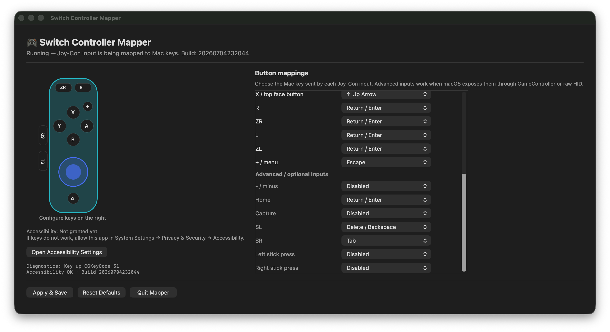

# Switch Controller Mapper

Minimal macOS mapper for Nintendo Switch controllers with a configurable desktop UI.



## Features

- Nintendo Switch Joy-Con / controller input mapping for macOS
- Configurable desktop UI with saved mappings
- Vertical Joy-Con defaults for arrows, Return, and Escape
- Raw HID fallback for Joy-Con buttons that GameController does not expose
- Built-in diagnostics for controller input and keyboard event output
- Local package scripts for clean builds, app bundle creation, and zip packaging

## Mapping

```text
D-pad / Stick Up    -> Up Arrow
D-pad / Stick Down  -> Down Arrow
D-pad / Stick Left  -> Left Arrow
D-pad / Stick Right -> Right Arrow

Vertical Joy-Con face buttons:
A / right face button  -> Right Arrow
B / bottom face button -> Down Arrow
Y / left face button   -> Left Arrow
X / top face button    -> Up Arrow

R / ZR -> Return
L / ZL -> Return
+       -> Escape
```

This mapper is optimized for vertical Joy-Con-style operation. It maps the physical Nintendo button labels directly: A/right to Right Arrow, B/bottom to Down Arrow, Y/left to Left Arrow, and X/top to Up Arrow.
For Joy-Con buttons that macOS GameController does not expose, the normal mapper also reads Nintendo raw HID report `0x3F` byte `2` bits `0x40`/`0x80` and maps those R/ZR signals to Return.
The physical `+`/menu/options button is mapped to Escape when exposed through GameController.

These are defaults. In the desktop app window, each supported input can be changed to another key or disabled. Settings are saved with macOS `UserDefaults` and applied again on the next launch.

Holding a D-pad direction or stick direction repeats the corresponding arrow key quickly. Face-button arrows A/B/X/Y repeat more slowly: one press moves once, then repeat starts only after a longer hold. If a controller disconnects, the mapper releases any held keys for that controller.
Controller input monitoring is enabled for background use, so the mapper can keep receiving controller input while another app is frontmost.

## Run

Use this command for normal use:

```sh
sh scripts/run-app.sh
```

`run-app.sh` is the recommended launch path. It stops old mapper processes, builds the release executable, and launches `.build/release/switch-controller-mapper` directly. This avoids macOS Accessibility/TCC confusion around rebuilt `.app` bundles while still showing the same desktop window.

If using `run-app.sh`, grant Accessibility permission to the terminal app that launched it, such as Terminal, iTerm, or VS Code.

The app window lets you change button mappings from dropdowns. Changes are saved automatically when you select a new value. Use **Reset Defaults** to return to the default Joy-Con layout.

## Build release zip

```sh
sh scripts/package-app.sh
```

This creates:

```text
dist/SwitchControllerMapper.zip
```

For broad public distribution outside your own machine, a Developer ID signature and Apple notarization are recommended. This project currently uses ad-hoc signing for local builds.

## Troubleshooting commands

Only use these when something is wrong:

```sh
swift run switch-controller-mapper --self-test
sh scripts/debug-input.sh
sh scripts/debug-hid.sh
sh scripts/reset-accessibility.sh
```

- `--self-test`: checks Accessibility trust and keyboard event creation
- `debug-input.sh`: shows GameController input names
- `debug-hid.sh`: shows raw Joy-Con HID reports
- `reset-accessibility.sh`: opens Accessibility settings after resetting this app's permission entry

## Project structure

```text
Sources/SwitchControllerMapper/
  main.swift                  Entry point and command-line mode selection
  AppDelegate.swift           AppKit window, configuration UI, diagnostics
  Mapping.swift               Key choices, input IDs, defaults, UserDefaults store
  Keyboard.swift              CGEvent keyboard emission and repeat handling
  ControllerMapper.swift      GameController input binding and mapping reload
  RawHID.swift                IOHID fallback/debug support for Joy-Con reports
  ControllerInputDebugger.swift  GameController input debug mode
  SelfTest.swift              Non-interactive diagnostics/self-test output

scripts/
  run-app.sh                  Recommended local launch path
  build-app.sh                Build ad-hoc signed .app bundle
  package-app.sh              Clean build + package zip for distribution testing
  clean-build.sh              Remove generated build products
  install-app.sh              Install .app to ~/Applications for local testing
  reset-accessibility.sh      Reset/open macOS Accessibility settings
  debug-input.sh              Log GameController input names
  debug-hid.sh                Log raw HID reports
  qa-macos.sh                 Manual QA checklist
```

## Release notes

This app synthesizes keyboard events, so macOS Accessibility permission is required. For real public distribution, use a stable bundle identifier, Developer ID signing, and Apple notarization. The local scripts are intended for development and distribution testing.

The bundled app opens a desktop window so you can confirm the mapper is running. The window shows a simple original Joy-Con schematic, configurable mappings, Accessibility status, and buttons for **Apply & Save**, **Reset Defaults**, and **Quit Mapper**. The app also keeps the 🎮 menu bar icon; you can quit cleanly from either the window button or the menu bar **Quit** item.

The Joy-Con visual is an original schematic drawn by the app, not an official Nintendo image or bundled 3D model.

`--self-test`, `--debug-input`, and `--debug-hid` are terminal/debug modes and do not show the normal desktop window.

Run macOS QA:

```sh
sh scripts/qa-macos.sh
```

Connect the controller with macOS Bluetooth before or after starting the command.

If key input is blocked, allow the built executable in:

```text
System Settings -> Privacy & Security -> Accessibility
```

When using `swift run`, grant Accessibility permission to the terminal app that launches it, such as Terminal or iTerm. When using the app bundle, grant Accessibility permission to `SwitchControllerMapper.app`. The desktop window shows whether Accessibility is currently granted, and the app prompts macOS to show the permission dialog when needed.

On menu-bar Quit, Ctrl-C, SIGTERM, or controller disconnect, the mapper releases any keys it is holding down. SIGKILL cannot be intercepted by any app.
